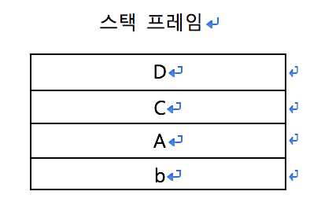
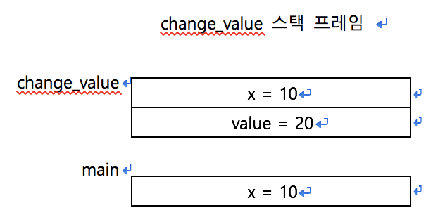
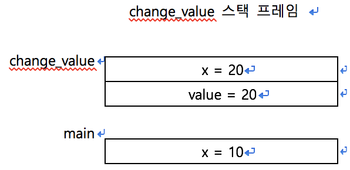
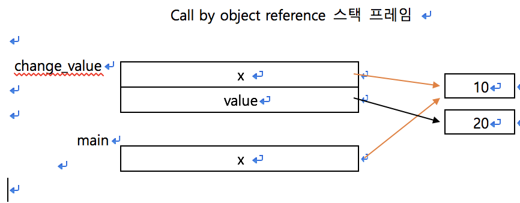
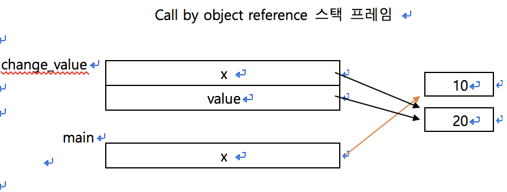
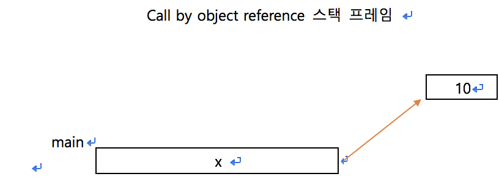
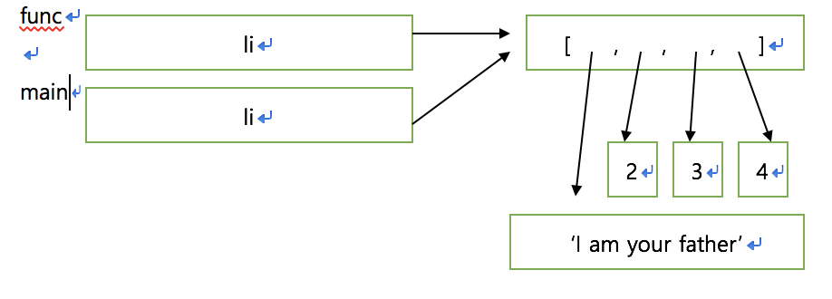

# 05.함수


## 함수를 시작하기 전에


### 자료구조 미리 엿보기
함수의 작동 원리를 이해하려면 스택의 개념을 반드시 알아야 한다. 스택은 접시 쌓기라고 생각하면 되는데, 데이터를 저장할 때는 접시처럼 차곡차곡 쌓아 올리고, 데이터를 꺼낼때는 접시처럼 맨 위부터 차례차례 내리게 된다. 즉, 마지막에 들어온 데이터가 가장 먼저 나가게 된다. `선입후출`

### 전역 변수와 지역 변수

#### 전역변수
전역번수(global variable)는 전체 영역에서 접근할 수 있는 변수이다. 함수 안에서도 접근할 수 있어야 한다.

```
g_var = 10
def func():
    print("g_var = {}".format(g_var))

if __name__ == "__main__":
    func()
```

g_var는 전역 변수이다. 함수안에서 전역 변수에 접근했고, 실행 결과를 보면 접근이 가능하다는 것을 알 수 있다.

함수 안에서 전역 변수의 변경을 해보면

```
g_var = 10

def func():
	g_var = 20
	print("g_var = {} in function".format(g_var))
	
if __name__ == "__main__":
	func()
	print("g_var = {} in main".format(g_var))
```
실행결과

```
g_var = 20 in function
g_var = 10 in main
```
실행결과를 보면 함수안에서는 `g_var` 값이 20으로 변경되었는데 함수 바깥에서 확인해 보면 값이 바뀌지 않는다. 함수 안에서 전역 변수 `g_var` 값의 변경을 시도하기 위해 선언한 `g_var` = 20은 전역 변수를 변경하는 것이 아니라 함수 안에서 새로운 지역 변수 `g_var`를 생성한 것이기 때문이다.

#### 지역 변수
지역(local variable)는 전역 변수와 반대 개념이다. 특정 지역에서만 접근할 수 있는 변수를 말한다. 특정 지역이란 함수 내부를 의미한다. 즉 함수 안에서 선언한 변수가 지역 변수이다. 지역 변수는 함수 바깥에서는 접근할 수 없고 함수가 호출될 때 생성되었다가 호출이 끝나면 사라지게 된다.

함수 안에서는 전역 변수에 접근만 할 수 있고 변경은 할 수 없는것은 아니다. 함수 안에서 전역 변수를 변경하려면 `global`이라는 함수를 사용하면 된다.

```
g_var = 10

def func():
	global g_var
	g_var = 20
	
if __name__ == "__main__":
	print("g_var : {} before".format(g_var))
	func()
	print("g_var : {} after" .format(g_var))
```

이렇게 global을 사용하면 아래처럼 바뀌게 된다.

```
g_var : 10 before
g_var : 20 after
```
여기서는 지역 변수를 따로 생성한 것이 아니라 전역 변수 `g_var`를 변경하게 되는 것이다.

#### nonlocal키워드
함수를 정희할 때 함수 내부에서 다른 함수를 정의할 수 있다.

```
def outer():
	a = 10
	def inner():
	b = 20
```
inner() 함수에서 outer() 함수의 지역 변수인 a를 변경할 수 있는지가 문제인데 변수 a는 outer() 함수 입장에서는 지역 변수지만 inner() 함수 입장에서는 지역 변수가 아니다. inner() 함수의 지역변수는 b이다.

```
a = 1

def outer():
	b = 2
	c = 3
	print(a, b, c)
	def inner():
		d = 4
		e = 5
		print(a, b, c, d, e)
	inner()
	
if __name__ == "__main__":
	outer()
```

실행결과
```
1 2 3
1 2 3 4 5
```

inner() 함수 안에서 b와 c를 바꾸려고 시도하면 outer()함수 공간에 접근하는 것이 아니라 inner() 함수 공간 안에 b와c라는 지역 변수를 생성하게 된다. b나 c는 전역 변수가 아니니 global을 사용할 수 없다. 그렇다면 inner() 함수 안에서 b와c를 어떻게 변경할까? 정답은 nonlocal을 사용하면된다.


```
def outer():
	a = 2
	b = 3
	
	def inner():
		nonlocal a
		a = 100
	inner()
	
	print("locals in outer : a = {}, b = {}".format(a, b))
	
if __name__ == "__main__":
	outer()
```

실행결과

```
locals in outer : a = 100, b = 3
```

결과를 보게되면 outer()함수의 지역변수를 inner()함수 안에서 nonlocal을 사용해서 변경하게 된다. inner()함수 안에서 outer()함수의 지역 변수 a를 사용할 것이라고 선언했기 떄문이다.

## 인자 전달 방식에 따른 분류

함수는 인자전달 방식에 따라 크게 `값에 의한전달 (call by vallue)`과 `참조에 의한 전달 (call by reference)`로 나누어진다. 파이썬은 값에 의한 전달과 참조에 의한 전달 방식을 사용하지 않기 때문에 c++코드로 알아보아야 한다.

### 값에의한 전달(call by value)

```
코드 5-6
#include <iostream>
using namespace std;

void change_value(int x, int value)
{
	x = value;
	cout << "x : " << x << " in change_value" << endl;
}

int main(void)
{
	int x = 10;
	change_value(x, 20);
	cout << "x : " << x << " in main" << endl;
	
	return 0;
}
```
실행결과

```
x : 20 in change_value
x : 10 in main
```

`#include`나 `using` 부분은 신경쓰지 않아도 된다. 주목해야 할 곳은 `void`, `int` 부분이다. 파이썬은 변수를 선언할 때 자료형을 명시하지 않는데 c++에서는 컴파일러에 알려 줘야 하므로 반드시 명시해야한다.

위의 코드에서 change_value()함수는 인자 x와 value를 받아 x에 value를 대입한다. main() 함수에서 지역 변수 x에 10을 대입한 다음 change_value() 함수를 호출하면서 value인자로 20을 전달했기 때문에 x의 값이 20으로 바뀔것 같지만 실행 결과를 보면 다른 값이 출력된다.

함수 안에서는 값이 변경 되었지만 함수를 호출한 쪽에서는 값이 변경되지 않았다. 지역 변수 x가 변경되지 않은 이유는 함수에 x가 전달될 때 값에 의한 전달 방식으로 전달 되었기 때문이다. 

함수가 호출될 때 메모리에는 '스택 프레임'이 생기게 된다. 스택 프레임은 함수의 메모리 공간 즉, 지역 변수가 존재하는 영역이다. 

```
코드 5-7
#include <iostream>
using namespace std;

int test(int a, int b);

int main(void)
{
	int a = 10, b = 5;
	int res = test(a, b):
	cout << "result of test : " << res << endl;
	return 0;
}


int test(int a, int b)
{
	int c = a + b;
	int d = a - b;
	return c + d;
}
```

위의 코드에서 주의깊게 봐야할 것은 test()함수의 정의와 main()함수에서 test()함수를 호출하는 부분이다. test()함수는 인자로 a와b를 받고, 지역 변수로 c와 d를 선언한다. 함수를 호출하면 아래와 같은 스택 프레임이 메모리에 생긴다.
<br>

<br>
위의 그림은 test()함수가 호춮될 때 생기는 스택 프레임이다. 스택 프레임에는 함수를 호출한 다음 복귀할 주소 값 등 지역 변수 이외의 정보도 담고 있다. main()함수도 함수이므로 스택 프레임을 갖는다 main() 함수의 스택 프레임의 모습은 아래와 같다.
<br>

<br>

```
main()함수의 b를 먼저 꺼내기 때문에 
test()함수에서 b가 아래에 깔리고 a가
그 위로 올라가는 것 이다.)
```

main()함수가 먼저 실행 되므로 스택 프레임이 먼저 쌓이고 main()함수 안에서 호출한 test()함수의 스택 프레임은 그 위에 쌓이게 된다. test()함수가 모두 실행되면 test() 함수의 스택 프레임이 먼저 사라지고 이후에 프로그램이 종료되면 main()함수의 스택 프레임이 사라지게 된다.

위의 표를 보게 되면 main()함수의 스택 프레임 공간에도 a와 b가 있고 test()함수의 스택 프레임 공간에도 a와 b가 있다. 두 공간은 서로 독립된 공간이다. 

`int res = test(a, b);`코드를 보면 인자를 전달 할 때 main()함수 스텍프레임의 지역변수인 a와 b를 전달한 것 같지만, 실제로는 test()함수 스택 프레임의 지역 변수 a와 b에 값만 '복사'한 것이다. 이처럼 인자를 전달할 때 값을 복사해 전달하는 경우를 '값에 의한 전달`call by value`'라고 한다. 말 그대로 값을 복사할 뿐이다.

이제 코드 5-6의`change_value(x, 20);`에서 change_value() 함수를 호출할 떄의 스택 프레임을 보고 main()함수의 지역 변수 x가 변경되지 않는 이유를 보도록 하자. 아래의 그림은 코드 5-6의 `x = value;`가 실행되기 직전에 본 스택 프레임이다.
<br>

<br>
change_value()함수 스택 프레임의 x와 main()함수 스택 프레임의 x는 서로 다른 메모리 공간에 존재하는 서로 다른 변수이다. 값만 10으로 같을 뿐이다. 아래의 그림은 `x = value;`가 실행되고 난 후의 스택 프레임 모습이다.
<br>

<br>
x에 value값을 대입했으므로 x값은 20이다.
여기서 중요한 점은 서로 다른 변수이기 때문에  main()함수의 지역 변수 x값은 변하지 않는다는 것이다. change_value() 함수는 change_value 스택 프레임의 지역 변수 x 값인 20을 출력하고, 실행이 끝나면 스택 프레임은 사라지게 된다. 아래의 그림은 change value() 함수의 호출을 완료한 후의 스택 프레임 모습이다.
<br>

<br>
이 상태에서 x 값을 출력하면 10이 출력된다. main()함수안의 지역 변수 x가 change_value() 함수 호출 후에도 값이 변경되지 않았는지 알았다. 인자를 값에 의한 전달 방식으로 전달했기 때문이다. 

함수 호출로 x값을 바꾸려면 참조에 의한 전달 방식으로 인자를 전달하면 된다.

### 참조에 의한 전달
참조에 의한 전달(call by reference)방식은 인자를 전달할 때 값을 전달하는게 아니라 참조를 전달한다.

```
코드5-8
#include <iostream>
using namespace std;

void change_value(int *x, int value)
{
	*x = value;
	cout << "x : " << *x << " in change_value" << endl;
}

int main(void)
{
	int x = 10;
	change_value(&x, 20);
	cout << "x : " << x << " in main " << endl;
	return 0;
}
```

실행결과
```
x : 20 in change_value
x : 20 in main
```

코드 5-8과 5-6을 비교해보면 함수 인자 목록에 int `x가 int *x로 바뀌었고, x = value;가 *x = value;`로 바뀌었다.

또한 change_value(x, 20)이 change_value(&x, 20)으로 바뀌었다. *와 & 연산자가 각각 무슨일을 하는지 알아보기 전에 실행 결가를 확인 해보면 이전에는 main()함수 안의 지역 변수 x 값이 바뀌지 않았는데 이번에는 바뀐 것을 알 수 있다.
`int*은 int형` 포인트를 의미한다. 
<br>
아래의 그림은 change_value()함수를 호출했을 때 `*x = value`가 실행되기 직전에 본 스택 프레임 모습이다.
<br>

<br>
change_value(&x, 20);에서 &x로 인자를 전달한다. 이는 main()함수 스택 프레임의 변수 x가 위치한 메모리 공간의 첫 번째 바이트 주소 값을 전달한다는 의미이다. 즉, 값 10을 전달하는 게 아니라 데이터 10을 저장하고 있는 4바이트 공간 중 첫 번째 바이트의 주소 값을 전달한다. `void change_value(int *x, int value)`의 인자 목록에서`int*x`는 포인터 변수를 의미한다. 
<br>포인터 변수도 다른 변수처럼 데이터를 저장한다. 단지 그 데이터가 메모리 주소일 뿐이다. change_value()함수 스택 프레임의 포인터 변수 x는 &x를 통해 change_value(&x, 20);에서 전달된 main()함수 스택 프레임 안의 지역 변수 x의 주소 값을 저장합니다.
<br>포인터 변수가 주소 값을 저장한다는 것은 위의 그림에서 change_value 스택 프레임 안에 있는 int형 포인터 x가 화살표를 따라 main() 함수의 지역 변수 x를 가리키는 것과 같은 의미이다. 이렇게 인자로 변수의 참조를 전달하는 방식을 참조에 의한 전달이라고한다(call by reference).
<br>

<br>

`*x = value;`에서 `*x`를 역참조라고 하며 x에 저장된 주소 값인 0x1111 1111로 접근한다. 이렇게 접근하여 value를 대입하면 main() 함수의 지역 변수 x가 있는 메모리 공간에 value값을 대입할 수 있다. 위의 main 스택 프레임의 x를 보면 값이 10에서 20으로 변경된 것을 볼 수 있다. change_value() 함수의 호출이 끝나면 change_value 스택 프레임은 사라지게 된다.
<br>
change_value() 함수의 호출을 완료한 다음 스택 프레임은 아래와 같이 바뀐다.
<br>

<br>

이제 x값을 출력하면 20이 출력된다. 함수에 참조를 인자로 전달함으로써 main() 함수 스택 프레임의 지역 변수 x값을 잘 변경할 수 있다. c/c++과 다르게 파이썬에서는 '객체 참조에 의한 전달'방식을 사용한다.


### 객체 참조에 의한 전달(파이썬) - 변경 불가능 객체를 전달할때

파이썬은 객체 참조에 의한전달(call by object reference)이라는 특별한 방식으로 인자를 전달한다. 파이썬에서는 함수를 호출할 때 인자로 전달된 객체를 일단 참조한다. 여기까지는 변경 불가능 객체든 변경 가능 객체든 상관이없다. 참조에 의한 전달과 비슷하다.

```
코드 5-9
def change_value(x, value):
	x = value
	print("x : {} in change_value".format(x))
	
if __name__ == "__main__":
	x = 10
	change_value(x, 20)
	print("x : {} in main".format(x))
```
실행결과

```
x : 20 in change_value
x : 10 in main
```

change_value(x, 20)에서 change_value() 함수를 호출하면서 인자로 x = 10을 전달하게 된다. 이때 change_value 스택 프레임이 생성되면서 def change_value(x, value):의 인자 x는 함수를 호출한 영역에 있는 x = 10을 참조하게된다. x = value를 실행하기 전에 스택 프레임이 어떤 모습인지 보자.
<br>

<br>

여기서 주의할 점은 파이썬의 변수는 c언어처럼 변수라는 메모리 공간에 값을 직접 저장하지 않는다. 파이썬에서는 변수 이름이 값 객체를 가리킨다. 파이썬에서도 참조에 의한 전달 방식을 쓰는 것 처럼 보일 수 있지만 함수 스택 프레임 안에서는 x값이 변경 되었지만, 함수를 호출한 쪽에서는 x값이 변경되지 않았다.
<br>
아래의 그림은 코드 5-9에서 `x = value`가 실행된 모습이다.
<br>

<br>

상수 객체는 변경 불가능 객체이기 때문에 변수 값을 바꾼다는 의미는 변수 이름이 가리키는 메모리 공간의 값을 직접 바꾸는 게 아니라 상수 객채리르 참조하는 것이다. `x = value	`코드는 x가 value가 가리키는 상수 객체를 참조하게 하는 코드이다. 
<br>
아래의 그림은 change_Value() 함수 호출이 끝난 뒤 스택 프레임 모습이다.
<br>

<br>
change_value 스택 프레임이 사라지면서 change_value() 함수의 지역 변수 x와 value가 사라졌다. 또한 레퍼런스 카운트가 0이 된 상수 객체 20도 사라지게 된다. 여기서 x를 출력하면 10이 나온다. 분명 이전에 알아본 값에 의한 전달방식이나 참조에 의한 전달 방식과 다르다.


#### 레버런스 카운트란?
메모리 영역 중에는 힙이라는 공간이 있다. c/c++에서는 힙에 할당한 메모리는 프로그래머가 직접 해제해야 하지만 c#, 파이썬, java 등에서는 메모리를 프로그래머가 직접 관리하지 않고 해당 언어가 스스로 해제한다. 더는 사용하지 않는 메모리를 언어 차원에서 해제한다는 개념을 가비지컬렉션(garbage collection)이라고 한다. 가비지 컬렉션의 구현에는 가장 단순한 Mark and Swepp부터 가장 빠르다고 알려진 Stop and Copy, Reference Counting 등 가비지 컬렉션을 구현하는 알고리즘에는 여러 가지가 있다. 파이썬에서는 레퍼런스 카운팅으로 가비지 컬렉션을 구현한다. 

### 객체 참조에 의한 전달(파이썬) - 변경 가능 객체를 전달할 때
이번에는 변경 가능 객체인 리스트를 인자로 전달해 보자.

```
코드 5-10
def func(li):
	li[0] = 'I am your father!'
	
if __name__ == "__main__":
	li = [1, 2, 3, 4]
	func(li)
	print(li)
```
실행결과

```
['I am your father!', 2, 3, 4]
```
코드 5-10을 보면 함수 안에서 리스트 li의 0번 인덱스 값을 변경한다. 함수를 호출한 쪽에서 리스트를 출력하면 이번에도 상수 객체처럼 변경 될 것 같으나 리스트의 요소가 변경 되었다. 

```
코드 5-11
def func(li):
	li = ['I am your father', 2, 3,4,]
	
if __name__ == "__main__":
	li = [1, 2, 3, 4,]
	func(li)
	print(li)
```
실행결과

```
[1, 2, 3, 4]
```
이번에는 함수 안에서 리스트 li에 새로운 리스트를 통째로 할당하였다. 그런데 실행 결과를 보면 이번에는 리스트가 변경되지 않았다.
코드 5-10과 코드 5-11을 보면 한 가지 차이점을 반결할 수 있는데, 코드 5-10은 참조한 리스트에 접근해 변경을 시도, 코드 5-11은 아예 다른 리스트를 메모리 공간에 새로 만든 다음 이를 참조해 리스트를 변경 하였다.

<br>



<br>

func 스택 프레임의 li와 main 스택 프레임의 li가 모두 같은 메모리 공간을 참조한다.
<br>

변경 불가능 객체는 값을 바꾸려면 다른 메모리 공간에 새로운 객체를 만든 다음에 참조를 통해 새로 만든 객체를 가리키게 만드는 수밖에 없다.
<br>튜플을 보면 튜플 값을 변경하려면 새로운 튜플을 만들 수밖에 없는것과 같다. 튜플의 요소를 변경할 수 없기 때문이다. 하지만 리스트는 변경 가능 객체이다. 
<br>위의 그림을 잘 보면 리스트의 첫번째 요소 값을 변경할 때 값 객체만 새로운 공간에 만들어 참조하면 된다. 즉, 값을 변경하기 위해 리스트 자체를 다른 메모리 공간에 새로 할당할 필요가 없다. <br>
아래의 그림은 코드 5-11에서 `li = ['I am your father', 2, 3, 4]를 실행한 다음 모습이다.
<br>

<br>

코드 5-10과 달리 이번에는 다른 메모리 공간에 새로운 리스트를 만들어 li로 참조했다. 요소가 아니라 리스트 자체를 변경하였다. 이 경우에는 함수 호출이 끝나면 func 스택 프레임이 사라지면서 새로 만들어진 리스트는 삭제된다. main의 지역 변수인 리스트 li는 변경되지 않는다.

<br>
객체 참조에 의한 전달 방식을 정리하면 다음과 같다.
<br>

* 함수 인자로 변경 불가능 객체를 전달해 값을 변경할 수 없다. 그 이유는 함수 안에서 새 객체를 만든 다음 참조하여 바꾸려 하면 함수 호출이 끝나고 스택 프레임이 사리지면서 참조도 사라지기 때문이다.
* 함수 내부에서 객체를 새롭게 할당해야만 값을 변경할 수 있는 객체는 변경 불가능 객체인 상수, 문자열, 튜플뿐이다.
* 리스트나 딕셔너리 같은 변경 가능 객체도 함수 안에서 새로운 객체를 만들 경우 함수 호출이 끝나면서 객체는 사라진다.
* 그러므로 변경 가능 객체를 인자로 전달할 때도 인자로 전달된 객체에 접근하여 변경 해야만 함수를 호출한 쪽의 객체를 변경할 수 있다.
* 이러한 파이썬의 인자 전달 방식을 객체 참조에 의한전달(call by object reference)방식이라고 한다.

## 람다 함수
람다 함수는 이름이 없는 함수이다. 이름이 없기 때문에 다음 행으로 넘어가면 다시 사용할 수 없다.

```
>>> li = [i for i in range(1, 11)
>>> li
[1, 2, 3, 4, 5, 6, 7, 8, 9, 10]
>>> li.sort(key = lambda x: x % 2 == 0)
>>> li
[1, 3, 5, 7, 9, 2, 4, 6, 8, 10]
```
li를 2의 배수와 2의 배수가 아닌 수로 나누고 싶다면 key인자에 람다 함수를 전달하고 오름차순으로 정렬하면 2의 배수가 뒤에 배치된다.
<br>

정렬 기준으로 사용하기 위해 함수를 따로 정의 하는것은 번거로운 작업이다. 이때 람다 함수를  사용하면 편리하게 정렬 기준을 제공할 수 있다.
<br>
아래와 같이 f로 람다 함수를 참조하면 이후 f를 함수처럼 사용할 수 있다.

```
>>> f = lambda x: x ** 2
>>> f(2)
4
>>> f(5)
25
```

람다함수에는 값을 반환하는 return문이 없다. 또한 람다 함수의 몸체에는 반드시 식이 들어가야 한다.

```
>>> f1 = lambda li, idx: li[idx]
>>> f2 = lambda li, idx, value: li[idx] = value
SyntaxError: can't assign to lambda
```
f1은 람다 함수를 잘 참조하는 반면, f2는 람다 함수를 참조하려 하지만 오류가 발생한다.  이유는 람다 함수 몸체에 있는 li[idx] = value가 할당문이기 때문이다. 즉, 식이 아니기 때문에 오류가 발생한 것이다.

### 마무리
함수의 인자 전달 방식은 매우 중요한 부분이니  완벽하게 이해하고 넘어가도록 하자.


