# CPU (책 참조 하기)

## 트랜지스터와 논리 게이트

+ 컴퓨터는 0과 1을 어떻게 구분하나? 컴퓨터도 전자기기니 전기적인 특성떄문이다.

### 전압, 전류, 저항

+ 전기의 특성에는 전압, 전류, 저항이 있다.
	+ 전압은 수압과 비슷함
		+ 예를 들어 전압이 높다는 말은 수위가 높은 댐 안에 갇힌 물의 수압을 떠올리고, 전압이 낮다면 평평한 곳에 흐르는 물의 수압을 떠올리면 편하다.
	+ 저항(압력), 전류(물의양)과 비슷함
		+ 예를들어 좁은 통로로 물이 흐른다고 가정, 높은 수압을 가진 물이 좁은 통로로 한 번에 나가려고 하면 통로에 엄청난 압력이 가해질것이다. 통로가 좁아 질수록 압력이 세고 흐르는 물의 양은 줄어든다. 여기서 압력은 `저항`에 해당하고 물의 양은 `전류`에 해당한다. 저항이 세지면 전류는 줄어든다.
+ 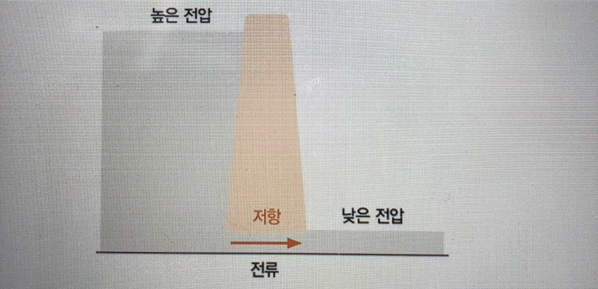
	+ 댐 안에서 높은 전압을 가지고 있다가 좁은 통로인 저항을 지나는 순간 전압이 완전이 낮아짐, 이렇게 저항을 지나면서 전압이 낮아지는 것을 `전압 강하`라고 한다.
+ 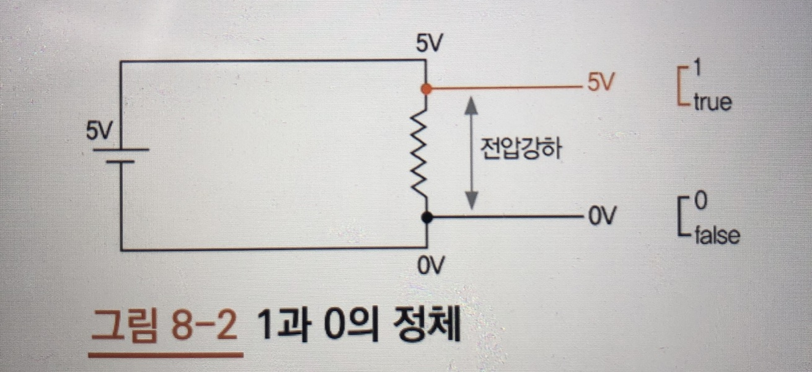
	+ 5V는 높은 전압 0V는 낮은 전압, 톱니 모양은 저항을 뜻함
	+ 전압이 저항을 지나면 전압 강하가 일어 난다(저항을 만나기 전 5V, 만난후 0V, 전압이 컴퓨터가 0과 1을 인식하는 방법)
	+ 5V나 5V에 가까운 높은 전압은 1 혹은 True로 인식
	+ 0V나 0V에 가까운 낮은 전압은 0 혹은 false로 인식

+ 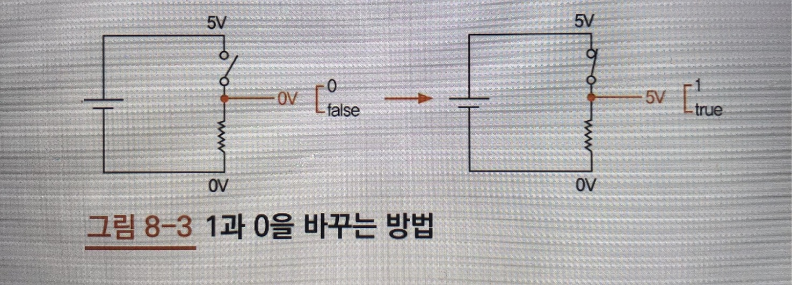
	+ 스위치를 하나 설치하고 전압을 알맞는 위치에서 측정하면 1과 0을 바꿀 수 있다.
+ 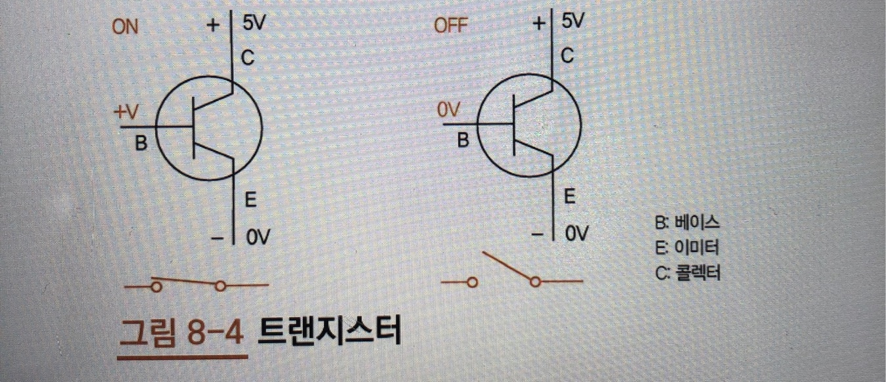
	+ 스위치 역할을 하는 것이 `트랜지스터`이다.

### 논리 게이트

+ 논리게이트란? 컴퓨터에 들어가는 수많은 디지털 회로를 구성하는 가장 기본적인 요소
	+ 쉽게 말해 불(bool	) 함수를 구현하기 위한 회로를 논리게이트라 하며, 논리 게이트를 사용해서 논리 연산을 할수도 있다.
	+ 기본 게이트에는 `AND`, `OR`, `XOR`, `NOT` 등이 있다.
	+ 논리 게이트에 들어오는 입력 값에 따른 모든 경우의 수를 나타낸 표를 `진리표라` 한다
	+ 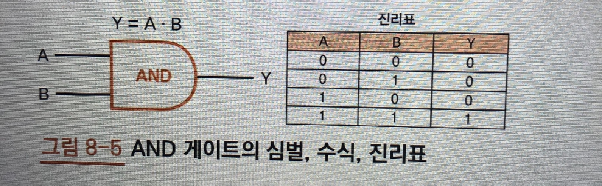
		+ A와 B는 입력 Y는 출력을 의미
	+ 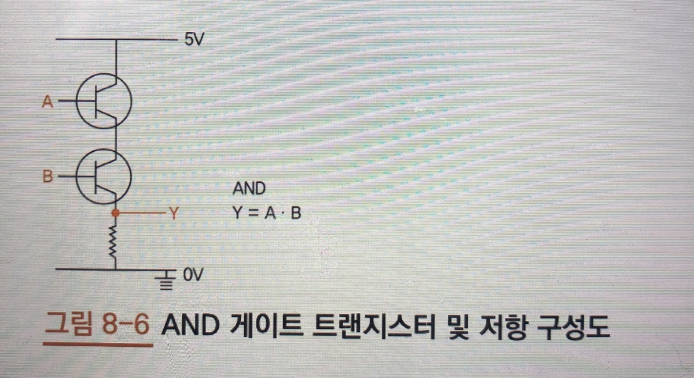
		+ AND게이트 구성도
	+ 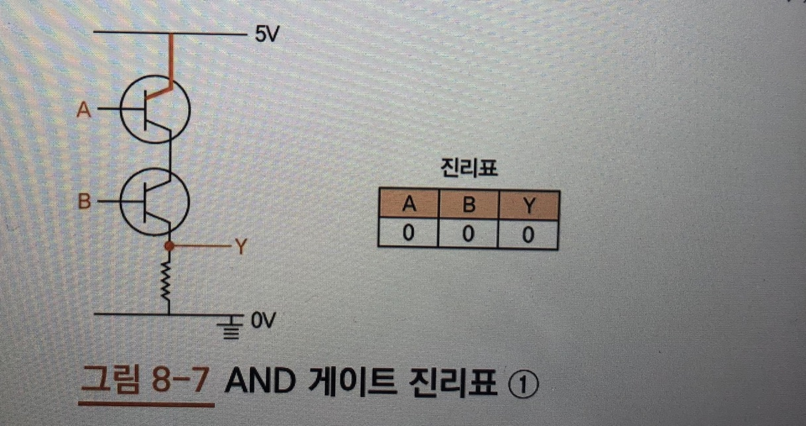
		+ A와 B가 0V일때, 다시 말해 두 입력이 모두 거짓일때 전류가 흐르지 않으므로 출력 Y는 0V 즉 거짓
	+ 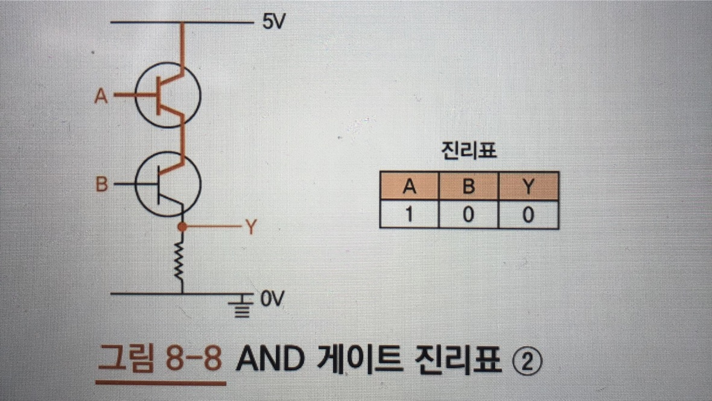
		+ A만 참일때, 전류가 흐르지만, 입력 B가 여전히 거짓이므로 아래쪽 트랜지스터에는 전류가 흐르지 않음.
	+ 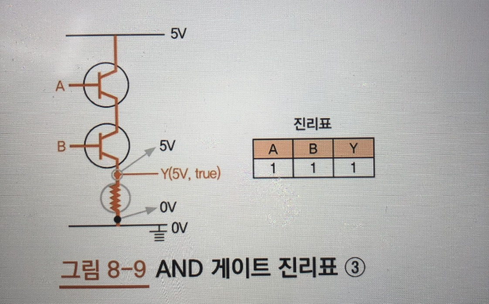
		+ 입력 A와 B가 모두 5V 즉, 참이므로 두 스위치가 모두 켜지면서 전류가 흐름
		+ AND 게이트 설계할 때 주의할 점은 출력 Y가 저항(톱니바퀴 모양) 이후 (검은색 작은 동그라미)로 설정되면 전압 강하가 생겨 0V 즉, 여전히 거짓이 된다.
	+ 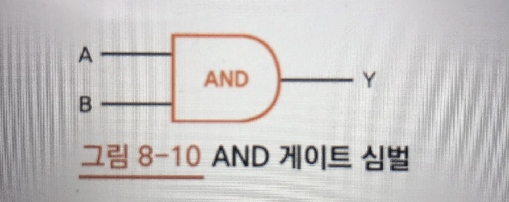
		+ AND 게이트를 매번 트랜지스터와 저항으로 표현하면 복잡하므로 단순화하여 나타냄
	+ 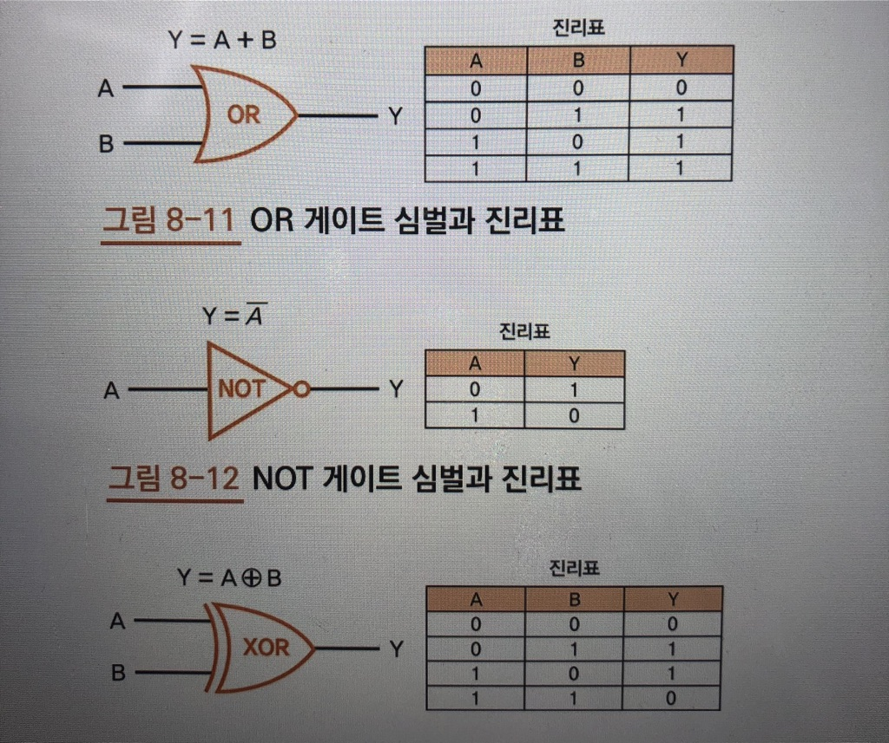
		+ 논리 게이트에는 많은 종류가 있다(OR, NOT, XOR)

## 조합 논리 회로와 가산기

+ 4비트 가산기를 만들기
	+ 조합논리회로, 순차논리회로, 가산기 개념 알기

### CPU의 구성
+ ALU, CU, IR, PC 
	+ CU(Control Unit)는 제어장치
		+ 우리가 작성한 코드는 컴퓨터가 이해할수 있는 언어인 기계어(0과 1로 이루어짐)로 번역되어 메모리에 저장 -> 이후 프로그램이 실행되면 CPU는 이 `명령어를 한줄 씩 읽어 들여 실행`, 이때 **어떤 명령어인지 해석하고 이를 실행하려고 할 때** CPU의 `각파트에 지시를 내리는 역활`을 하는 것이 `제어 장치`이다.
	+ ALU(Arithmetic Logic Unit, 산술 논리 연산)
		+ 덧셈, 뺄셈 같은 산술 연산과 AND(논리곱), OR(논리합) 같은 논리 연산을 하는곳
	+ ALU와 CU를 제외한 AX, BX, IR, PC는 모두 레지스터이다
		+ CPU 안에 내장된 메모리라고 생각하자

> 조합논리회로와 순차논리회로를 이해하면 CPU의 원리를 정확하게 이해할 수 있다.

+ 조합논리회로(Comvinational Login Circuit)
	+ 현재 입력에 의해서만 출력이 결정되는 논리 회로를 말함
+ 가산기는 ALU 내부에 위치하고 레지스터 AX 와 BX값을 입력받음
	+ AX와 BX가 덧셈 연산 후 다시 AX로 출력된다. AX에서 A는 Accumulator로 이름 그대로 값을 축적해 나가는 레지스터

### 가산기
+ 가산기에는 단순히 비트 두 개만 더하는 `반가산기(half-adder)`와 `캐리(carry)`까지 연산에 포함하는 `전가산기(full-adder)`가 있다.
	+ 전가산기는 반가산기 두 개와 OR 게이트 한 개로 이루어짐
		
> 나중에 책 그림참조하기

###	`반가산기는 XOR 게이트와 AND 게이트가 하나씩만 있으면 만들 수 있다.`

+ CI는 Carry In, CO는 Carry Out을 의미
+ 캐리는 받아올림 수
+ 예) AX  = 1 , BX = 1 를 받았을때 2진수 덧셈을 한다면 1과 1이 더해져 10이나온다
	+ 같은 자릿수끼리 더해 윗자리로 수를 올려줘야 하는 것을 받아올림 (carrying)이라한다.
	+ 출력회로가 하나라면 아랫자리 수인 0을 출력하고 윗자리 수인 1은 Carry Out을 통해 출력
	+ 이때 윗자리 수를 캐리(받아올림 수)라고 한다
+ CI는 입력으로 생각하고 CO는 출력으로 생각하자
	+ 가산기는 오로지 입력만이 출력 값을 결정( `조합 논리 회로의 특징` )
	
### 순차 논리 회로와 레지스터

+ 순차논리회로(Sequential Logic Circuit)
	+ 현재의 출력이 현재의 입력과 과거의 출력에 따라 정해지는 논리 회로
+ AND게이트 앞에 동그라미가 추가된 논리 게이트가 NAND게이트 이다.
	+ NAND게이트는 AND게이트의 값을 반전시키면 된다
+ 입력이 바뀌 었다고 해서 출력이 바로 바뀌는 것이 아니라 특정 상황이 되었을 때만 바뀐다는 점과 이를 통해 이전 출력 값이 유지 된다는 점
	+ 출력값이 `유지`된다는 특성을 다르게 표현하면 `저장`된다고 할수 있다
	+ 플립플롭을 메모리 소자 즉, 메모리를 구성하는 기본 단위라고 부름 (CPU 안에 있는 레지스터는 사실 많은 플립플롭의 묶음 이다)

> 나중에 책 그림참조하기

### 클록

+ 진자란 왔다 갔다를 반복하는 주기 운동
	+ 진자가 1초 동안 왕복한 횟수를 주파수라 한다
	+ 전자가 1초 동안 두 번 왕복했을때의 주파수를 국제단위계(전 세계 사람들이 단위를 맞추기 위해 만든 표준 단위)	`f = 2Hz = 2cyclc/scc`
	+ 2헤르츠(Hz) `진자가 1초 동안 두번 왕복했다`, 또는 `진자가 한 번 왕복하는데 0.5초가 걸린다`라고도 표현 한다. 이를 주기라고 하며 수식으로 표현하면 **`책 그림참조`**
+ 주파수와 주기는 반비례 관계
+ 클록 속도(clock rate)는 CPU 혹은 프로세서 속도의 지표로 1초에 클록이 몇 번 발생했는가를 의미
	+ 컴퓨터 내부에 클록 발생기가 있는데 이 발새기는 일정한 시간에 맞춰 펄스(신호)를 생성
+ 인스트럭션(instruction)
	+ 우리가 작성한 코드가 CPU에서 실행되기 위해 최종적으로 변환된 기계어 명령어
	+ 클록 주파수가 높을수록 1초당 상승 에지 수가 높아 지고 그만큼 실행되는 인스트럭션 수도 늘어날 테니 CPU의 주파수가 높을수록 연산 속도가 빠른 성능 좋은 컴퓨터이다!

> 성능을 나타내는 지표로 CPI(Clock cycles Per instruction)가 있는데 이는 인스트럭션당 클록수를 나타냄(예를들어 메모리 접근은 높은 클록 수를 요구한다)

### 시스템 버스

+ IR(Instruction Register) 
	+ C = A + B 코드는 한 줄이지만 기계어로 번역하면 최소 네 개의 명령어로 변환된다
	+ 변환된 명령어는 프로그램을 실행하면 메인 메모리에 올려지고 하나씩 실행되는데 이때 메모리에 있는 명령어를 CPU로 가져와 저장해 두는 곳이 `IR` 이다
+ PC(Program Counter)
	+ 현재 실행 중인 명령어 다음에 실행될 명령어의 메모리 주소를 담고 있다
+ AX, BX, AX 와 BX는 범용 레지스터
	+ 주로 메모리에서 읽어 들인 데이터를 저장했다가 ALU가 연산할 때 피연산자로 전달하거나 연산 결과 값을 저장할 때 쓰임

### 시스템 버스의 구성과 특징

+ 데이터 버스(Data Bus)
	+ 제어 버스의 신호(signal)에 따라 데이터를 CPU에서 메모리로 전송하거나 반대로 메모리에서 CPU로 전송
	+ 데이터 버스는 양방향이어야 한다.
+ 제어 버스(control Bus)
	+ 데이터를 레지스터로 읽어올지(READ) 아니면 메모리에 쓸지(WRITE) CPU가 메모리에 전달
+ 주소 버스(Address Bus)
	+ 메모리에서 레지스터로 혹은 레지스터에서 메모리로 데이터를 전송할 때 필요한 메모리 주소를 전달한다
	+ CPU가 메모리에 알려 주는 형식이므로 단방향이다.

	
### 인스트럭션 세트

+ 인스트럭션 세트(instruction set)
	+ CPU가 인식하여 실행할 수 있는 기계어
	+ 어셈블리어는 기계어를 사람이 읽을 수 있도록 일대일로 대응한 문자 형태
	+ 인스트럭션 세트는 CPU마다 다름
	+ 새로운 CPU를 도입했다면 그 CPU에 적합한 인스트럭션 세트로 다시 프로그래밍 해야함
	
### 명령어 종류

+ 1 바이트에서 앞에 3비트는 명령어 종류를 의미
+ 명령어의 바이너리 코드모음( `책 참조하기` )
+ ADD( 덧셈 ), SUB( 뺄셈 ), MUL( 곱셈 ), DIV( 나눗셈 )
+ LOAD는 메모리에서 레지스터로 데이터를 가져오는 명령어
+ STORE는 레지스터에서 메모리로 데이터를 저장
+ 직접 주소 방식(Direct Addressing Mode)
+ 간접 주소 방식(Indirect Addressing Mode)

